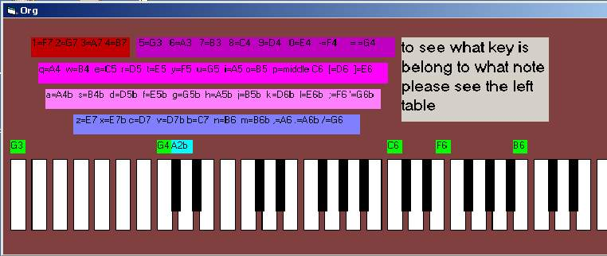

<div align="center">

## electronic keyboard \( organ\)


</div>

### Description

press the keys and hear the different note from pc internal speaker.you can play music like piano.

this code work in

win 95,98,me .I promise next time to write the code for windows 2000 .in this coe I use port address of internal pc speaker.plese vote it.thank you.

(YOU MUST COPY "INPOUT.DLL" to directory "windows\system" and "windows\system32" or

in run type regsvr32 path\inpout32.dll
 
### More Info
 
the address of internal pc speaker for turn on and turn off it

different sound. music note


<span>             |<span>
---                |---
**Submitted On**   |2002-01-24 23:34:16
**By**             |[reza talatian azad](https://github.com/Planet-Source-Code/PSCIndex/blob/master/ByAuthor/reza-talatian-azad.md)
**Level**          |Intermediate
**User Rating**    |4.0 (20 globes from 5 users)
**Compatibility**  |VB 4\.0 \(32\-bit\), VB 5\.0, VB 6\.0
**Category**       |[Sound/MP3](https://github.com/Planet-Source-Code/PSCIndex/blob/master/ByCategory/sound-mp3__1-45.md)
**World**          |[Visual Basic](https://github.com/Planet-Source-Code/PSCIndex/blob/master/ByWorld/visual-basic.md)
**Archive File**   |[electronic507711242002\.zip](https://github.com/Planet-Source-Code/reza-talatian-azad-electronic-keyboard-organ__1-31153/archive/master.zip)

### API Declarations

```
Public Declare Function Inp Lib "inpout32.dll" _
Alias "Inp32" (ByVal PortAddress As Integer) As Integer
Public Declare Sub Out Lib "inpout32.dll" _
Alias "Out32" (ByVal PortAddress As Integer, ByVal Value As Integer)
```


